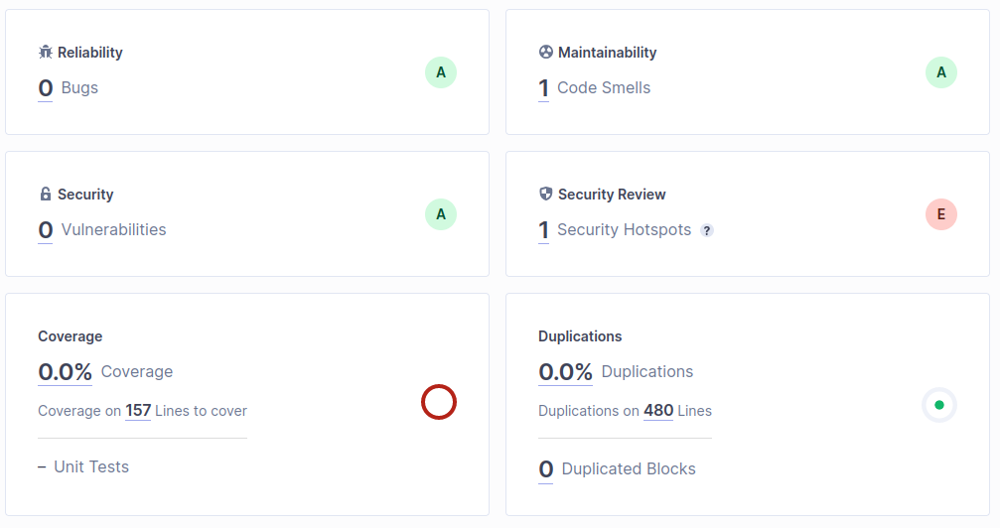
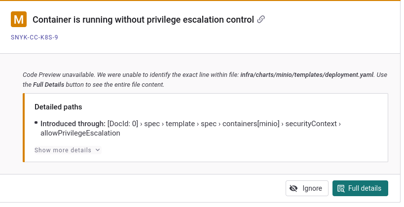
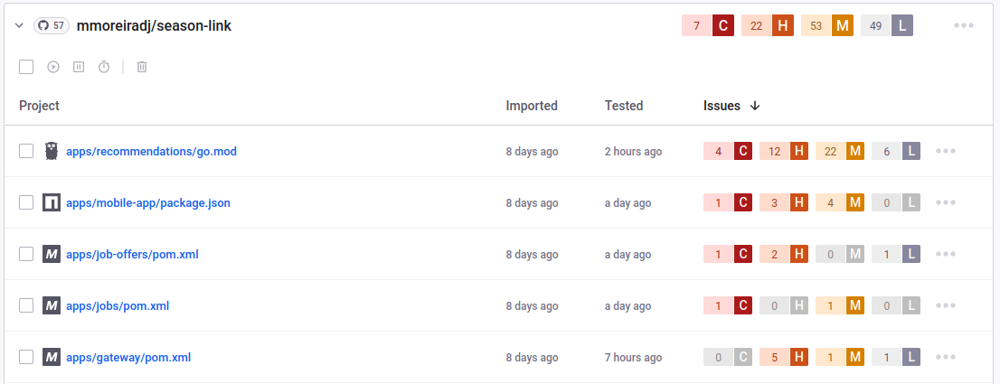

# Security Policies

<!-- TOC start (generated with https://github.com/derlin/bitdowntoc) -->

* [Introduction](#introduction)
* [Summary](#summary)
* [Standard web security practices (OWASP)](#standard-web-security-practices-owasp)
  + [Input Validation](#input-validation)
  + [Authentication](#authentication)
      - [Brute Force Detection](#brute-force-detection)
      - [Password Policy](#password-policy)
      - [Tokens](#tokens)
      - [Client Authentication](#client-authentication)
  + [Access Control](#access-control)
      - [Least Privilege](#least-privilege)
  + [Encryption](#encryption)
  + [Error Handling and Logging](#error-handling-and-logging)
  + [Communication Security](#communication-security)
      - [External Communication](#external-communication)
      - [Internal Communication](#internal-communication)
  + [Files](#files)
  + [Memory Leaks](#memory-leaks)
* [Vulnerability analysis](#vulnerability-analysis)
  + [Static Application Security Testing (SAST)](#static-application-security-testing-sast)
  + [Software composition analysis (SCA)](#software-composition-analysis-sca)
* [Production Environment Hardening](#production-environment-hardening)
  + [Docker images - build process ](#docker-images-build-process)
  + [Kubernetes Network Security ](#kubernetes-network-security)
  + [Monitoring](#monitoring)
  + [Secret handling](#secret-handling)
      - [Secrets during development](#secrets-during-development)
* [CI/CD security](#cicd-security)
  + [Secrets](#secrets)
  + [Reusing Actions](#reusing-actions)
  + [Least Privilege](#least-privilege-1)

<!-- TOC end -->

<!-- TOC --><a name="security-policy"></a>
# Security Policy

<!-- TOC --><a name="introduction"></a>
## Introduction

The objective of this document is to provide a clear and concise explanation of the actions taken by the project maintainers to ensure the security of the project and its users.

The application is a Job Board for seasonal workers, it has features such as:

- profile creation
- job listing
- job application
- a recommendation system
- a chat system
- a review system

It is a microservice-based web application that provides a REST API for a mobile application made with React Native.

It is built with the following technologies:

- Node.js Rest APIs (NestJS)
- Java Rest APIs (Spring Boot & Quarkus)
- Go Rest API (Standard Library)
- NATS for message broker
- Rust (Axum)
- PostgreSQL
- Keycloak

<!-- TOC --><a name="summary"></a>
## Summary

- Standard web security practices (OWASP)
    - Input Validation
    - DoS Attacks
- Static Application Security Testing & Software Composition Analysis
- Production environment security
- CI/CD security
- Pen Testing ?

<!-- TOC --><a name="standard-web-security-practices-owasp"></a>
## Standard web security practices (OWASP)

The project follows the OWASP standards for web security. The following are the practices that are implemented:

<!-- TOC --><a name="input-validation"></a>
### Input Validation

Input validation is crucial in web security for several reasons:

- Prevent Injection Attacks
- Data Integrity
- Avoid Cross-Site Scripting (XSS)
- Prevent Malicious File Execution
- Limit Denial of Service (DoS) Attacks (e.g. by limiting the size of the input)

The project uses the following libraries to ensure input validation:

- NestJS Validation Pipe + class-validator
- Spring Boot Hibernate Validator
- Go's standard library
- Rust Serde

<!-- TOC --><a name="authentication"></a>
### Authentication

Authentication is the process of verifying that an individual, entity or website is who it claims to be. It's an important part of web security. Indeed, it is the first line of defense against unauthorized access to web resources.

Since it is such an important part of web security, the project uses Keycloak to handle authentication. Keycloak is an open-source Identity and Access Management (IAM) solution that provides a single sign-on and identity management for web and mobile applications.

It's a secure, flexible, and easy-to-use solution that is used by the project to ensure the security of the application.

This takes care of the following:

- Authentication
- Authorization
- Identity Brokering
- User Federation
- Social Login
- User Accounts Management
- etc.

We've also chosen to increase the security of the application by editing the following settings in Keycloak:

- Brute Force Detection
- Password Policy
- Tokens

<!-- TOC --><a name="brute-force-detection"></a>
#### Brute Force Detection

Go to `realms > YOUR_REALM > Realm Settings > Security Defenses > Brute Force Detection` and set the following:


<!-- TOC --><a name="password-policy"></a>
#### Password Policy

Go to `realms > YOUR_REALM > Athentication > Policies > Password Policy` and set the following:


<!-- TOC --><a name="tokens"></a>
#### Tokens

Go to `realms > YOUR_REALM > Realm Settings > Tokens` and set the following:

For the access token:


This ensures the access token is short-lived which is a good practice for security.

For the refresh token:


This ensures only one user can be logged in at a time with a refresh token and that the refresh token can only be used once.

<!-- TOC --><a name="client-authentication"></a>
#### Client Authentication

There are many ways to interract with Keycloak and OAuth2. The project uses the `Authorization Code` flow for the web application and the `Client Credentials` flow for the REST API.

This is the most secure way to interract with Keycloak and prevents the client from having to store or manipulate the user's credentials as well as avoid potential replay attacks or malicious redirections.

<!-- TOC --><a name="access-control"></a>
### Access Control

Access control is the process of limiting access to a system or to physical or virtual resources. It is a fundamental concept in security that minimizes risk to the business or organization.

By default, all our routes are protected by Keycloak unless explicitly stated otherwise. This ensures that only authenticated users can access the routes.

We also use roles to limit the resources that a user can access. For example, only an admin can access the admin dashboard.

In that sense, we both use Role-Based Access Control (RBAC) and Attribute-Based Access Control (ABAC).

<!-- TOC --><a name="least-privilege"></a>
#### Least Privilege

The principle of least privilege is the practice of limiting access rights for users to the bare minimum permissions they need to perform their work. This helps to reduce the risk of a user abusing their privileges. In case of a breach, the damage could also be limited.

For example, we use a service account for the application that needs to access Keycloak. 

<!-- TOC --><a name="encryption"></a>
### Encryption

Encryption is the process of converting information or data into a code, especially to prevent unauthorized access. In

Our application itself does not handle sensitive data. However, we use Keycloak to handle sensitive data such as passwords and tokens.

<!-- TOC --><a name="error-handling-and-logging"></a>
### Error Handling and Logging

Logs and error handling are crucial for security.

Error handling is important to ensure that the application does not expose sensitive information to the user. For example, we do not want to expose the stack trace of an error to the user. It's also crucial for data integrity.

Whereas logs do not only help in debugging, but they also help in identifying security issues.

All our services send logs to the standard output. Theses logs are json-formatted, and expose the following fields:

- `level`: the log level (info, warn, error, etc.)
- `message`: the log message
- `timestamp`: the timestamp of the log
- `context`: the context of the log (e.g. the route, the user, etc.)

These logs are then collected by another service for further analysis.

<!-- TOC --><a name="communication-security"></a>
### Communication Security

<!-- TOC --><a name="external-communication"></a>
#### External Communication

All external communication is done through HTTPS. This ensures confidentiality, integrity, and authenticity of the communication.

This is achieved through traefik, a reverse proxy and cert-manager, a Kubernetes add-on that automatically provisions TLS certificates.

<!-- TOC --><a name="internal-communication"></a>
#### Internal Communication

Internally, our applications communicate in different ways:

- HTTP (REST APIs)
- TCP (postgres, NATS, Neo4j)

NATS communication is encrypted by default. Our database drivers also support encryption.

For the REST APIs, we use Istio, a service mesh that provides mutual TLS for all the communication between the services. (we would like to use it, but it's not implemented yet).

<!-- TOC --><a name="files"></a>
### Files

File upload are an important part of our application. It's also a common attack vector. Theses attacks include:

- Uploading Malicious Files
- Overwriting Files
- Denial of Service (DoS) Attacks
- Path Traversal

To prevent these attacks, for simpler implementation and better user experience, we use S3 to store the files. This also ensures:

- ACLs
- Server-Side Encryption
- Logging
- etc.

<!-- TOC --><a name="memory-leaks"></a>
### Memory Leaks

Memory leaks are a common security issue. They can lead to:

- Denial of Service (DoS) Attacks
- Information Disclosure
- etc.

We use the following tools to prevent memory leaks:

- Rust's ownership system
- Go's garbage collector
- Java's garbage collector
- Node.js's garbage collector

<!-- TOC --><a name="vulnerability-analysis"></a>
## Vulnerability analysis
Over time, vulnerabilities are discovered in our dependencies. This is also bound to happen in the software that we write.
In order not to stay vulnerable for long, it is important to keep track of the vulnerabilities in the librairies and to ensure that the software that we write isn't flawed.

<!-- TOC --><a name="static-application-security-testing-sast"></a>
### Static Application Security Testing (SAST)
Static Application Security Testing (SAST) is the process of analyzing the source code of an application to identify security vulnerabilities.
To analyse the source code, 2 tools were put in place:
- SonarQube: This tool brings up security hotspot in addition to code quality issues. 
- Snyk: This tool brings up vulnerabilities in the code in addition to vulnerabilities in the dependencies of the application.



With empiric data, it was found that SonarQube is better at finding code quality issues, while Snyk is better at finding vulnerabilities in the dependencies of the application. 

Snyk seems to behave in a more consistent way in multi-project repositories, and was able to identify issues with deployement related files (Helm charts)



<!-- TOC --><a name="software-composition-analysis-sca"></a>
### Software composition analysis (SCA)
Software composition analysis is the process of identifying the vulnerabilities in the dependencies of the application.
In order to keep track of the vulnerabilities in the dependencies of the application, Snyk is used.



<!-- TOC --><a name="production-environment-hardening"></a>
## Production Environment Hardening
When an application is deployed onto the production environment, it is important to ensure that the environment is hardened. 

This means reducing the attack surface of the environment by using the minimum amount of services, ensuring that each service is up-to-date, and ensuring that the services are configured securely (usually, by disabling development mode).

This also means locking down network communications between services, ensuring that only the necessary services can communicate with each other.

<!-- TOC --><a name="docker-images-build-process"></a>
### Docker images - build process 
To reduce the attack surface, during the build process of the OCI images, the following steps are taken:

- If possible, use images provided by bitnami, as they already provide a secure base image. Otherwise, use the official images, hopefully an `alpine` variant since it is smaller and has less attack surface.

- Ensure binaries are up to date by updating them via `apt/apk update` and `apt/apk upgrade`.

- Copy only the necessary files into the image. This is done by using a `.dockerignore` file to exclude unnecessary files and directories.

- Ensure that the image is not running as root. This is done by using the `USER` directive in the Dockerfile. Do not forget to give the user the necessary permissions to run the application via the `chown` command. 

- If possible, remove write permissions from the user running the application.

- Ensure that the image is not running in development mode. For example, in our NodeJS services, we use the `NODE_ENV` environment variable to set the environment to `production`, and in our Go services, we use the `GIN_MODE` environment variable to set the environment to `release`.

- Make the build process multi-stage to reduce the attack surface. You don't need the build tools in the final image.

<!-- TOC --><a name="kubernetes-network-security"></a>
### Kubernetes Network Security 
In order to lock down the network communication between services, in our production kubernetes cluster, we made use of network policies.

Network policies allow us to define the rules for network traffic for each service.
As such, we limited the ingress of each service to only accept TCP traffic from the services that need to communicate with it. Additionally, we accept DNS traffic from the `kube-system` namespace to allow the services to communicate with the Kubernetes cluster.

For simplicity, we did not limit the Egress, meaning that each service is able to communicate with the wider internet. For increased security, we should limit the Egress to only the necessary traffic, which can be hard to quantify.

<!-- TOC --><a name="monitoring"></a>
### Monitoring
In the event a security breach occurs, we need to be able to detect it as soon as possible. We use Falco with the default rule set to monitor for suspicious activity in the cluster.
It is setup with a webhook to send alerts in a discord channel.


<!-- TOC --><a name="secret-handling"></a>
### Secret handling
Secrets are sensitive information that should not be exposed. Leaking them forces us to rotate them, which can be a painful process and create downtime if the issue is extremly critical.

<!-- TOC --><a name="secrets-during-development"></a>
#### Secrets during development
To limit the exposure of secrets, we used the `pre-commit` tool to run `yelp`'s `detect-secrets` tool to ensure that no secrets are ever committed to the repository.

<!-- TOC --><a name="cicd-security"></a>
## CI/CD security

Supply chain attacks are a growing concern in the software industry. It's important to ensure that the CI/CD pipeline is secure.

Our CI/CD system is build with GitHub Actions. It's a cloud-based CI/CD service that is integrated with GitHub (it can also be self-hosted but we use the cloud version).

There are several security measures that are implemented in the CI/CD pipeline:

<!-- TOC --><a name="secrets"></a>
### Secrets

Secrets are sensitive data that are used in the CI/CD pipeline. For example, the credentials to access the database, the credentials to access the container registry, etc.

These secrets are stored in GitHub Secrets. They are encrypted and only accessible to the CI/CD pipeline, they do not appear in the logs.

<!-- TOC --><a name="reusing-actions"></a>
### Reusing Actions

GitHub actions are reusable pieces of code that can be used in the CI/CD pipeline. It's important to audit the actions that are used to ensure that they are secure.

Theses actions are called using the `uses` keyword in the workflow file. For example:

```yaml
- uses: actions/checkout@v2
```

Notice the `@v2` at the end of the action. This is the version of the action that is used. However, a tag can be edited to point to a different version of the action which could be exploited by an attacker.

To make sure the version of the action is the one you audited, you can use the `@sha` of the action. For example:

```yaml
- uses: actions/checkout@sha256:1a2b3c4d5e6f7g8h9i0j1k2l3m4n5o6p7q8r9s0t1u2v3w4x5y6z
```

This ensures that the action is the one you audited.

<!-- TOC --><a name="least-privilege-1"></a>
### Least Privilege

The CI/CD pipeline should have the least privilege. It should only have the permissions it needs to perform its work.

This can be achieved with the `permissions` feature of GitHub Actions. For example:

```yaml
permissions:
  contents: read
  issues: write
  pull-requests: write
```

This ensures that the CI/CD pipeline only has the permissions it needs.

We also only give the necessary permissions to the CI/CD pipelines for external services. For example, we use GitHub Apps for SonarQube, Snyk, etc. and only give the necessary permissions.

As for values such as a Kubeconfig, we create a service account with the least privilege (e.g. only access to one namespace) and use it in the CI/CD pipeline.
